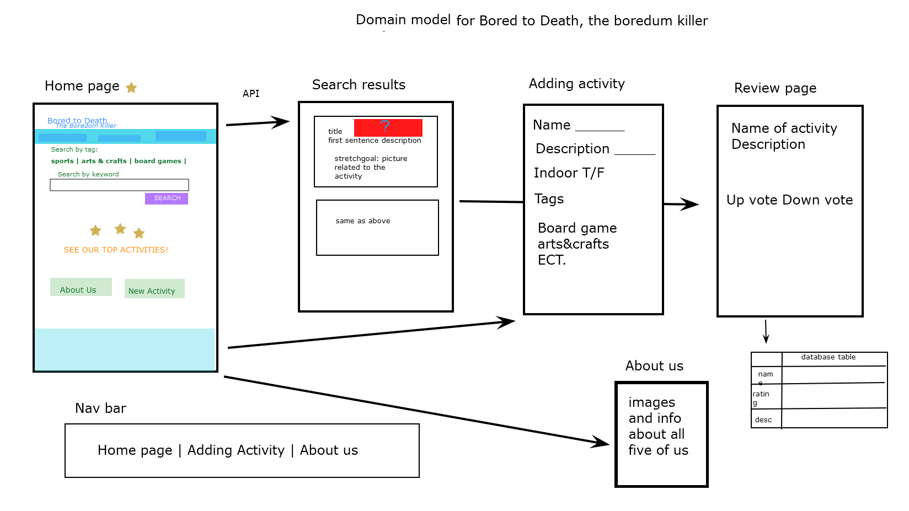
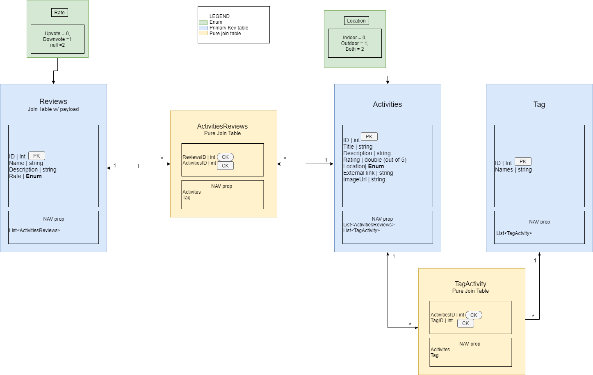
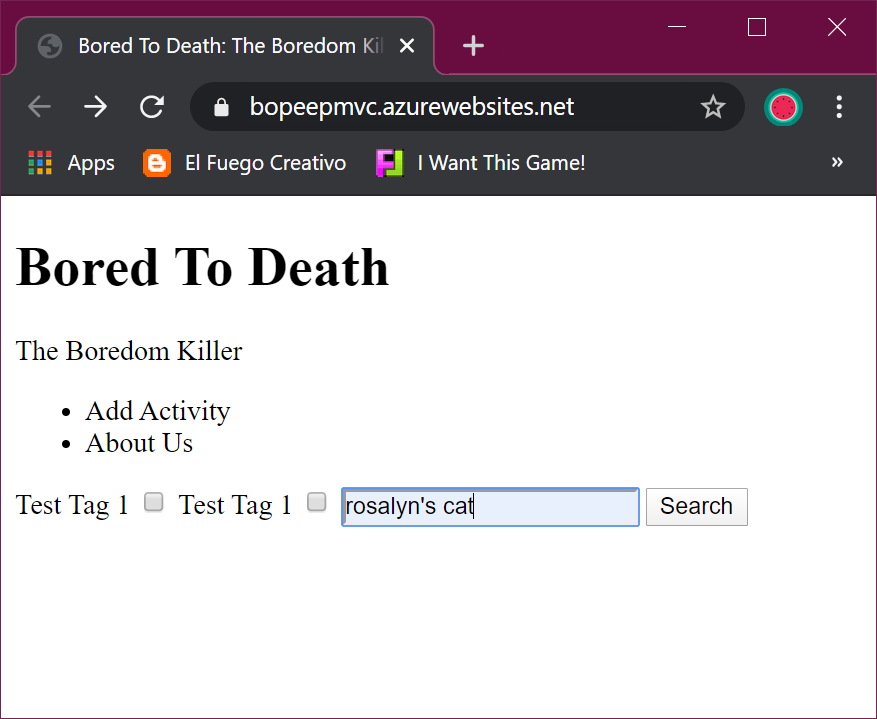
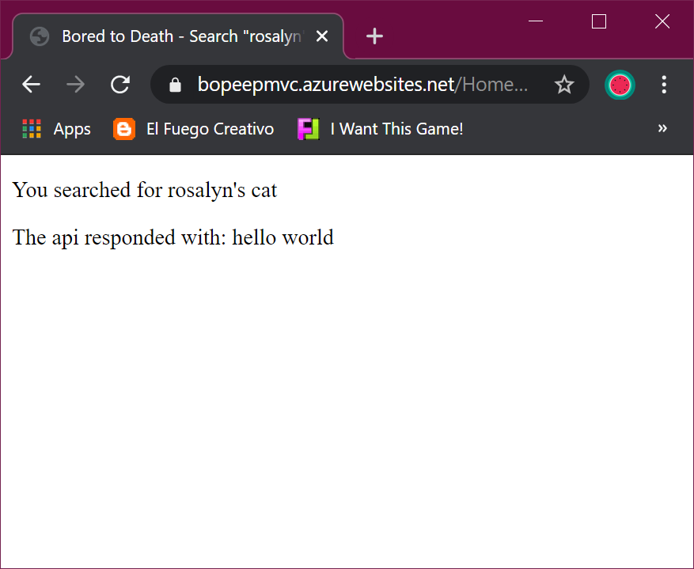

# Bored To Death - *The Boredom Killer*


### Deployed Websites

[Bored To Death](https://bopeepmvc.azurewebsites.net/)  

[API Server](https://bobeepapi.azurewebsites.net/api)

---

## Authors

[Brody Rebne](https://github.com/brody-rebne)  
[Harlen Lopez](https://github.com/harlenlopez)  
[Harry Cogswell](https://github.com/HCoggers)  
[Jin Kim](https://github.com/jinwoov)  
[Rosalyn Johnson](https://github.com/rosbobos)

---

## Web Application

This application is created to suggest and review activities that we can do during our quarantine life. This application is consists of CRUD operation that utilize API backend server and ASP.NET core viewmodel for frontend. The framework of this application is build upon MVC framework. 

---

## Getting Started

Clone this repository to your local machine.

```
$ git clone https://github.com/TeamBoPeep/BoPeepMVCApp.git
```
Once downloaded, you can either use the dotnet CLI utilities or Visual Studio 2019 to build the web application. The solution file is located in the BoPeepMVCApp subdirectory at the root of the repository.
```
cd root/BoPeepMVCApp
dotnet build
```
The dotnet tools will automatically restore any NuGet dependencies. Before running the application, the provided code-first migration will need to be applied to the SQL server of your choice configured in the `root`/BoPeepMVCApp/appsettings.json file. This requires the `Microsoft.EntityFrameworkCore.Tools NuGet package `and can be run from the NuGet Package Manager Console:
```
Update-Database
```
Once the database has been created, the application can be run. Options for running and debugging the application using IIS Express or Kestrel are provided within Visual Studio. From the command line, the following will start an instance of the Kestrel server to host the application:
```
cd root/BoPeepMVCApp
dotnet run
```

---

## Visual

### Domain Model


### ERD Diagram


### Final Pages
*FINAL PAGES GOES HERE*

### Initial Pages v 1.0
##### Index Page

##### Result Page
  

---


## Tools Used
[Microsoft Visual Studio Community 2019](https://visualstudio.microsoft.com/)

- C#
- ASP.Net Core
- Entity Framework
- MVC
- [MySQL](https://www.mysql.com)
- [Azure](https://portal.azure.com)
- [Postman](https://www.postman.com/)  
special thanks to Canva (https://www.canva.com/photos/) for the images we used to seed our activities data

---

## **Change Log**  
2.0: *Pages are completed and about me page is updated* - April 14, 2020  
1.1: *Review page and activities pages are added* - April 14, 2020  
1.0: *Site is Deployed to Azure, with API calls and Data   Persistence* - April 13, 2020  
0.1: *Repository and README is initialized* - April 8 2020  
