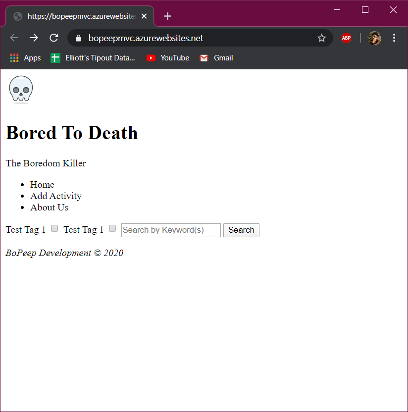
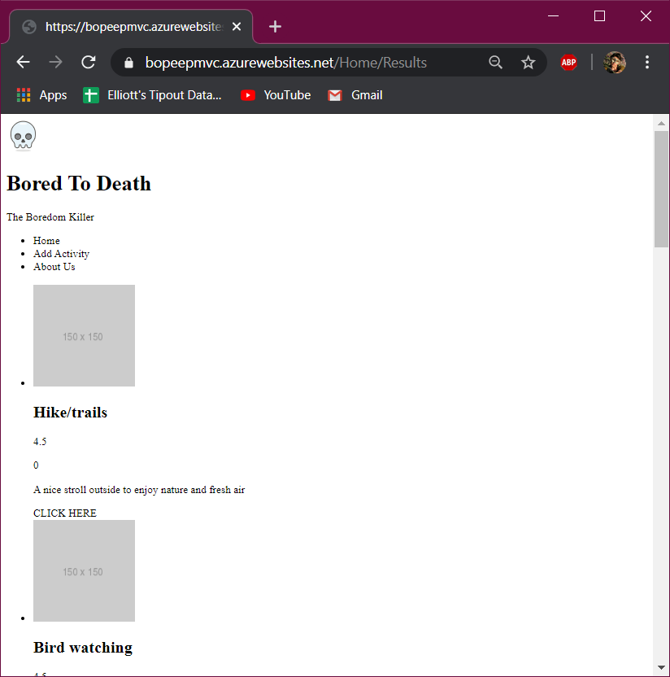

# BoPeepMVCApp (Project TBA)

### We are deployed on Azure!

[Bored To Death](https://bopeepmvc.azurewebsites.net/)

---

## Authors

[Brody Rebne](https://github.com/brody-rebne)  
[Harlen Lopez](https://github.com/harlenlopez)  
[Harry CogsWell](https://github.com/HCoggers)  
[Jin Kim](https://github.com/jinwoov)  
[Rosalyn Johnson](https://github.com/rosbobos)

---

## Web Application

This application is created to suggest and review activities that we can do during our quarantine life. This application is consists of CRUD operation that utilize API backend server and ASP.NET core viewmodel for frontend. The framework of this application is build upon MVC framework. 

---

## Tools Used
Microsoft Visual Studio Community 2019

- C#
- ASP.Net Core
- Entity Framework
- MVC
- Azure

---

## **Change Log**  
> updates  
1.0: *Site is Deployed to Azure, with API calls and Data Persistence* - April 13, 2020

  
0.1: *Repository and README is initalized* - April 8 2020  